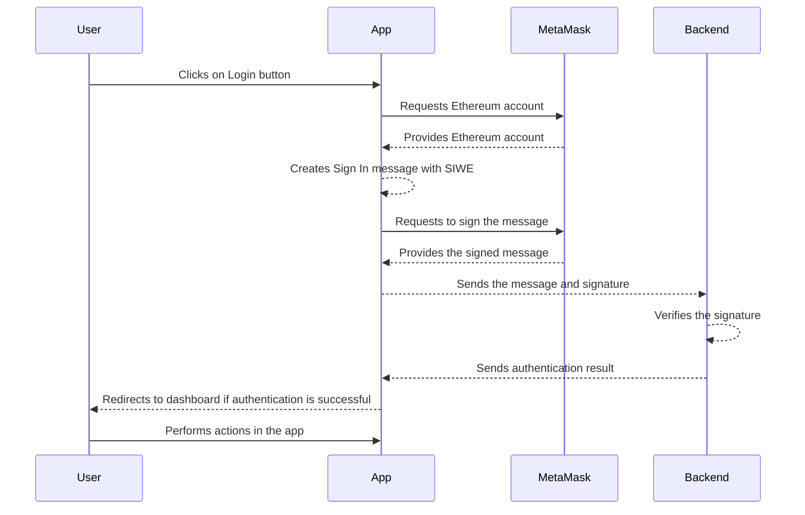

# SIWE Demo
This is a `Next.js` demo app showcasing the implementation of Sign In With Ethereum (SIWE) authentication mechanism.

## Specifications
SIWE uses [ERC-4361](https://eips.ethereum.org/EIPS/eip-4361#workflow) specification that describes how Ethereum accounts authenticate with off-chain services by signing a standard message. In the context of SIWE, ERC-4361 defines the structure and content of the SIWE message that the users will sign with their private key to prove the ownership of their account.

## SIWE Workflow
- **Connect Wallet**: The user connects their Ethereum wallet to the app using a standard such as MetaMask.

- **Create SIWE Message**: The app will generate a unique `nonce` for each session and send it to the user along with other message parameters to construct a SIWE message. The `nonce` is used as the identification for the session and to prevent the replay attacks. 

- **Sign SIWE Message**: The users then signs the SIWE message with their private key using their wallet and send it back to the app along with the signature. The signatuer is a cryptographic proof that the user owns the Ethereum account associated with the address in the SIWE message.

## Sequence Diagram
The following sequence diagram demonstrates the flow of interactions between the user, app, MetaMask and the backend server during the login process.

